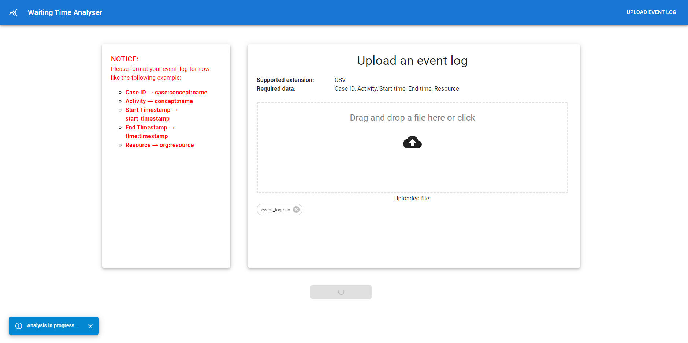
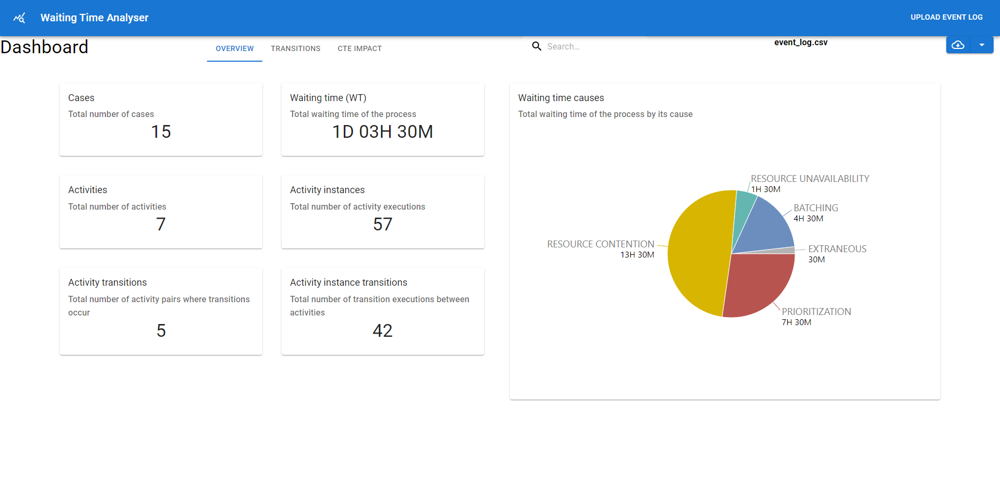
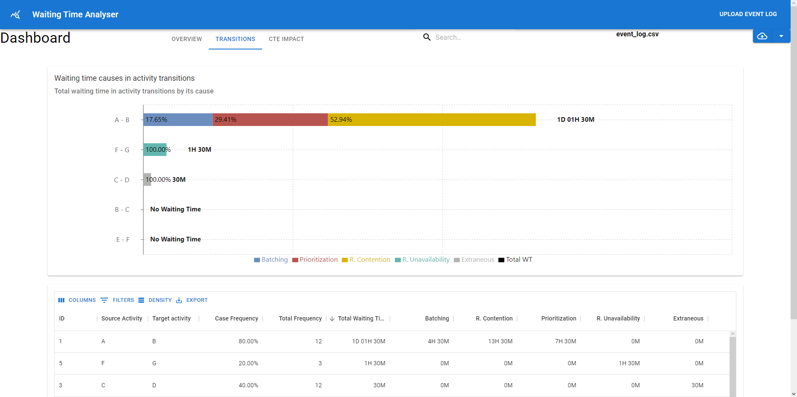
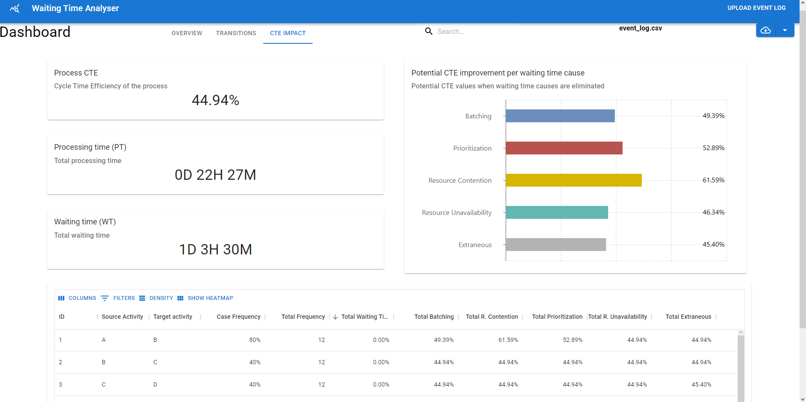

# Waiting Time Analysis Client

Frontend client for Waiting Time Analysis tool.

## Expected functionalities:

- Upload of event log (CSV format)
- Mapping of selected event log (required parameters)
- Dashboard overview of results
  - Overview
    - Generic information about event log
  - Transitions
  - CTE Impact

## TODO'S:

- Upload functionality
- Event log mapping
- Server API connection
- Download functionality
- CTE Impact

## Presentable progress:

### Home - Upload:

### Home - Uploading:

### Dashboard - Overview

### Dashboard - Transitions

### Dashboard - CTE Impact

### Dashboard - Download Report
