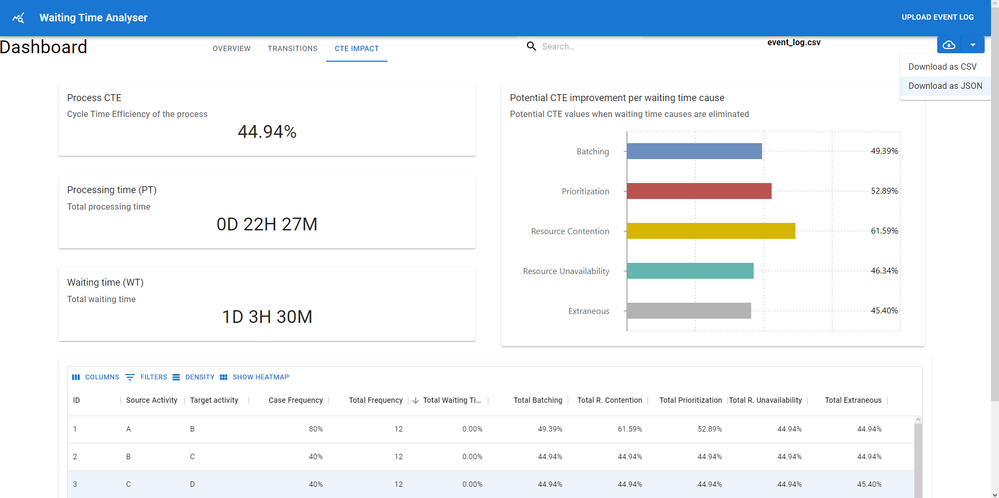

# Waiting Time Analysis Client


Frontend client for Waiting Time Analysis tool.

[//]: # (Will try to make this work)
[//]: # (https://dev.to/salehmubashar/search-bar-in-react-js-545l#:~:text=Creating%20the%20Search%20Bar&text=In%20your%20app.,"%20import%20".%2FApp.)

## Start the client locally (via npm)

> Please, note that you need to have `Node.js` and `npm` installed on your computer in order to follow these steps. The instructions on how to do that could be found here: https://docs.npmjs.com/downloading-and-installing-node-js-and-npm#overview
1) Install all dependencies
    ```
    npm install
    ```
   If you run into issues with the previous command run the following command:
   ```
   npm install --save --legacy-peer-deps
   ```
2) Start the client
    ```
    npm start
    ```


## Included functionalities:

- Upload of event log (CSV format)
- Mapping of selected event log (required parameters)
- Dashboard overview of results
  - Overview: ```Generic information about event log```
  - Transitions ```Information about transitions between activities```
  - CTE Impact ```Information about Cycle time efficiency impacts```
- Sorting and filtering for tables
- Download of report in CSV and JSON format
- Custom tooltips for most dashboard charts and info boxes
- Heatmap to easily spot improvement opportunities

## Upcoming functionalities:
- Event log mapping | WIP => Frontend OK. Backend server needs to accept mapping object in request for processing

## Visual showcase:

### Home - Upload:

### Home - Mapping:

### Home - Uploading:

### Dashboard - Overview

### Dashboard - Transitions

### Dashboard - Transitions Table details

### Dashboard - CTE Impact

### Dashboard - CTE Impact Table details

### Dashboard - CTE Impact Heatmap

### Dashboard - Download Report
